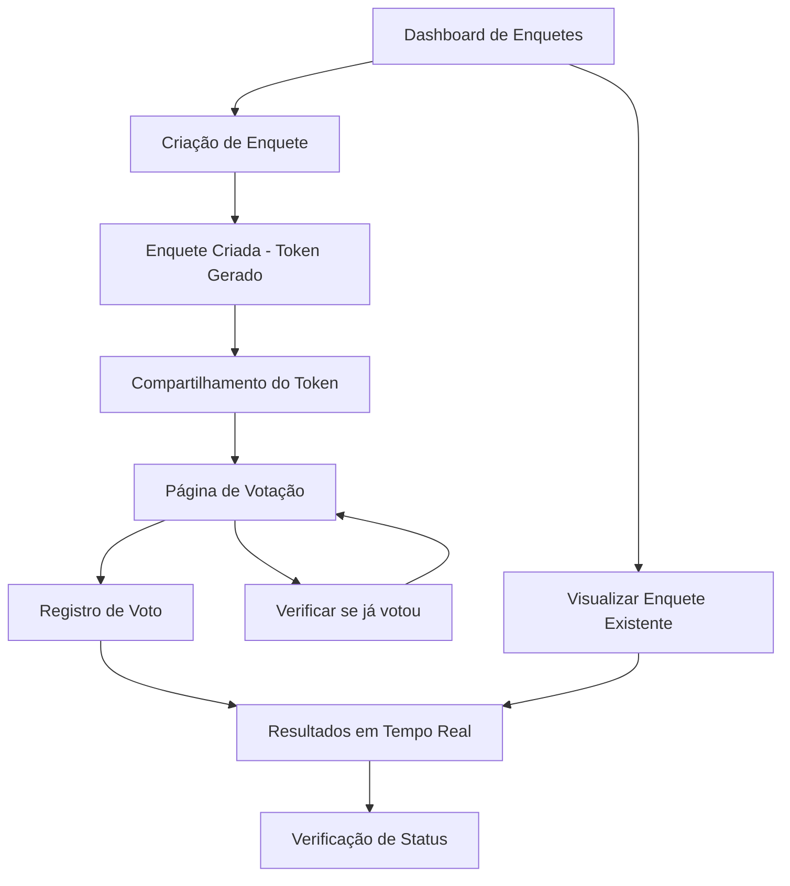

# DinamiQ - Sistema de Enquetes em Tempo Real

## 1. Product Overview

DinamiQ é uma plataforma de enquetes interativas que permite criar, compartilhar e participar de votações em tempo real. O sistema oferece atualizações instantâneas dos resultados conforme os votos são registrados, proporcionando uma experiência dinâmica e engajante para todos os participantes.

O produto resolve o problema de coleta de opiniões e feedback de forma rápida e interativa, sendo ideal para apresentações, eventos, salas de aula, reuniões corporativas e pesquisas de mercado. O valor principal está na capacidade de visualizar resultados em tempo real, aumentando o engajamento e a participação dos usuários.

## 2. Core Features

### 2.1 User Roles

| Role | Registration Method | Core Permissions |
|------|---------------------|------------------|
| Criador de Enquete | Acesso direto via API | Pode criar enquetes, visualizar todas as enquetes, acessar resultados completos |
| Participante | Identificação via user_uid único | Pode votar em enquetes usando token, visualizar resultados em tempo real |

### 2.2 Feature Module

Nosso sistema de enquetes consiste nas seguintes páginas principais:

1. **Dashboard de Enquetes**: listagem de todas as enquetes criadas, estatísticas gerais, acesso rápido às enquetes ativas.
2. **Criação de Enquete**: formulário para criar nova enquete, adição de múltiplas opções, geração automática de token de acesso.
3. **Página de Votação**: interface para participar da enquete, visualização das opções disponíveis, confirmação de voto.
4. **Resultados em Tempo Real**: exibição dinâmica dos resultados, gráficos de votação, atualizações automáticas via WebSocket.
5. **Verificação de Status**: página para verificar se o usuário já votou, histórico de participação.

### 2.3 Page Details

| Page Name | Module Name | Feature description |
|-----------|-------------|---------------------|
| Dashboard de Enquetes | Lista de Enquetes | Exibir todas as enquetes criadas com título, token, data de criação e total de votos |
| Dashboard de Enquetes | Estatísticas Gerais | Mostrar métricas como total de enquetes, votos recebidos e enquetes ativas |
| Criação de Enquete | Formulário de Criação | Permitir inserir título da enquete e adicionar múltiplas opções de resposta |
| Criação de Enquete | Geração de Token | Gerar automaticamente token único de 8 caracteres para acesso à enquete |
| Criação de Enquete | Validação de Dados | Validar campos obrigatórios e garantir pelo menos 2 opções por enquete |
| Página de Votação | Interface de Votação | Exibir título da enquete e opções disponíveis para seleção |
| Página de Votação | Registro de Voto | Processar voto do usuário e atualizar contadores em tempo real |
| Página de Votação | Prevenção de Voto Duplo | Verificar user_uid para impedir múltiplos votos do mesmo usuário |
| Resultados em Tempo Real | Exibição de Resultados | Mostrar contagem atual de votos para cada opção com percentuais |
| Resultados em Tempo Real | Atualizações WebSocket | Atualizar resultados automaticamente quando novos votos são registrados |
| Resultados em Tempo Real | Gráficos Dinâmicos | Renderizar visualizações gráficas dos resultados de votação |
| Verificação de Status | Consulta de Voto | Verificar se usuário específico já participou da enquete |
| Verificação de Status | Histórico de Participação | Mostrar em qual opção o usuário votou (se aplicável) |

## 3. Core Process

**Fluxo do Criador de Enquete:**
1. Acessa o dashboard e clica em "Criar Nova Enquete"
2. Preenche o título da enquete e adiciona as opções de resposta
3. Submete o formulário e recebe o token único da enquete
4. Compartilha o token com os participantes
5. Monitora os resultados em tempo real conforme os votos chegam

**Fluxo do Participante:**
1. Recebe o token da enquete do criador
2. Acessa a página de votação usando o token
3. Visualiza o título e opções disponíveis
4. Seleciona sua opção preferida e confirma o voto
5. Visualiza os resultados atualizados em tempo real
6. Pode continuar acompanhando as atualizações dos resultados

## 4. User Interface Design

### 4.1 Design Style

- **Cores Primárias**: Azul (#2563eb) para elementos principais, Verde (#16a34a) para confirmações
- **Cores Secundárias**: Cinza (#6b7280) para textos secundários, Vermelho (#dc2626) para alertas
- **Estilo de Botões**: Botões arredondados com bordas suaves (border-radius: 8px), efeitos hover suaves
- **Fontes**: Inter ou system fonts, tamanhos 14px para texto base, 18px para títulos, 24px para cabeçalhos
- **Layout**: Design card-based com espaçamento generoso, navegação superior fixa, layout responsivo
- **Ícones**: Ícones minimalistas do Heroicons ou Lucide, estilo outline para ações secundárias, filled para ações primárias

### 4.2 Page Design Overview

| Page Name | Module Name | UI Elements |
|-----------|-------------|-------------|
| Dashboard de Enquetes | Lista de Enquetes | Cards com sombra sutil, título em negrito, token em fonte monospace, badges para status ativo/inativo |
| Dashboard de Enquetes | Estatísticas Gerais | Widgets com números grandes, ícones coloridos, fundo gradiente suave |
| Criação de Enquete | Formulário de Criação | Campos de input com labels flutuantes, botão "+" para adicionar opções, preview em tempo real |
| Criação de Enquete | Geração de Token | Modal de sucesso com token destacado, botão de copiar com feedback visual |
| Página de Votação | Interface de Votação | Radio buttons customizados, título centralizado, botão de voto proeminente |
| Página de Votação | Confirmação de Voto | Toast notification de sucesso, transição suave para resultados |
| Resultados em Tempo Real | Exibição de Resultados | Barras de progresso animadas, percentuais em destaque, cores diferenciadas por opção |
| Resultados em Tempo Real | Atualizações WebSocket | Indicador de "ao vivo" piscante, animações suaves nas mudanças de dados |
| Verificação de Status | Consulta de Voto | Badge de status colorido, informações organizadas em lista |

### 4.3 Responsiveness

O produto é desenvolvido com abordagem mobile-first, garantindo experiência otimizada em dispositivos móveis e tablets. Inclui otimizações para interação touch, como botões com área mínima de 44px, gestos de swipe para navegação e feedback tátil. O layout se adapta automaticamente para desktop com aproveitamento do espaço adicional através de grids responsivos e sidebars colapsáveis.