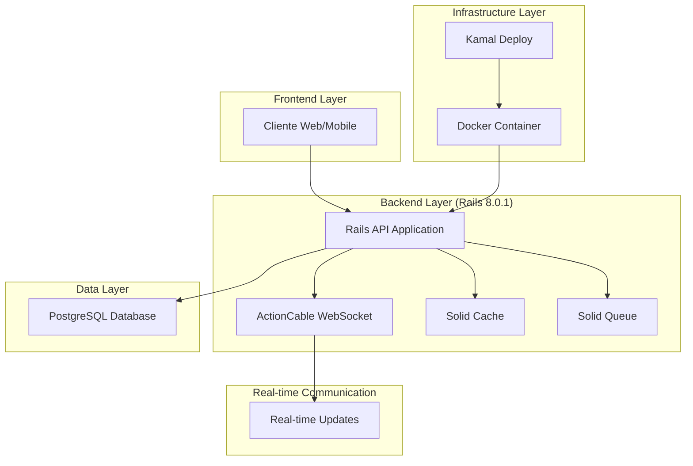
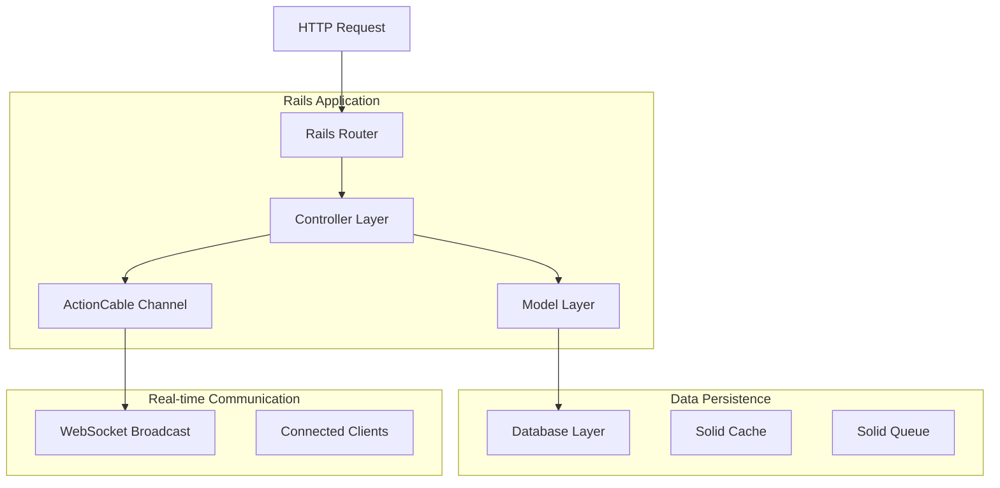
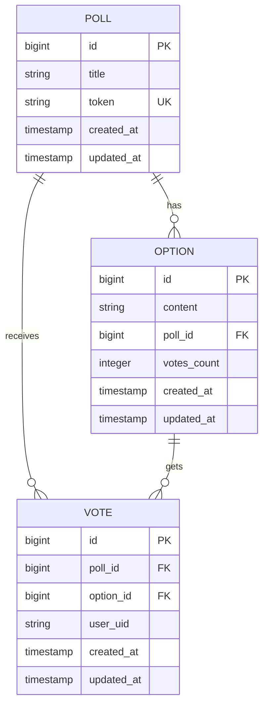

# DinamiQ - Arquitetura Técnica

## 1. Architecture Design



## 2. Technology Description

- **Backend**: Rails 8.0.1 API + ActionCable + PostgreSQL
- **Cache**: Solid Cache (database-backed caching)
- **Queue**: Solid Queue (background job processing)
- **WebSocket**: Solid Cable (ActionCable with database adapter)
- **Database**: PostgreSQL 
- **Deployment**: Kamal + Docker
- **Additional**: RQRCode gem for QR code generation

## 3. Route Definitions

| Route | Purpose |
|-------|---------|
| GET /polls | Lista todas as enquetes criadas com suas opções |
| POST /polls | Cria uma nova enquete com opções aninhadas |
| GET /polls/:token | Visualiza enquete específica usando token único |
| POST /polls/:token/vote | Registra voto do usuário na enquete |
| GET /polls/:token/check_vote | Verifica se usuário já votou na enquete |
| GET /up | Health check para monitoramento da aplicação |
| WS /cable | Conexão WebSocket para atualizações em tempo real |

## 4. API Definitions

### 4.1 Core API

**Listar Enquetes**
```
GET /polls
```

Response:
| Param Name | Param Type | Description |
|------------|------------|-------------|
| id | integer | ID único da enquete |
| title | string | Título da enquete |
| token | string | Token único de 8 caracteres |
| created_at | datetime | Data de criação |
| options | array | Array de opções da enquete |

Example Response:
```json
[
  {
    "id": 1,
    "title": "Qual sua linguagem favorita?",
    "token": "a1b2c3d4",
    "created_at": "2025-01-15T10:00:00Z",
    "options": [
      {
        "id": 1,
        "content": "JavaScript",
        "votes_count": 15
      },
      {
        "id": 2,
        "content": "Python",
        "votes_count": 23
      }
    ]
  }
]
```

**Criar Enquete**
```
POST /polls
```

Request:
| Param Name | Param Type | isRequired | Description |
|------------|------------|------------|-------------|
| title | string | true | Título da enquete |
| options_attributes | array | true | Array de opções com content |

Example Request:
```json
{
  "poll": {
    "title": "Qual sua linguagem favorita?",
    "options_attributes": [
      { "content": "JavaScript" },
      { "content": "Python" },
      { "content": "Ruby" }
    ]
  }
}
```

**Visualizar Enquete**
```
GET /polls/:token
```

Response: Retorna enquete específica com opções incluídas

**Votar na Enquete**
```
POST /polls/:token/vote
```

Request:
| Param Name | Param Type | isRequired | Description |
|------------|------------|------------|-------------|
| option_id | integer | true | ID da opção escolhida |
| user_uid | string | true | Identificador único do usuário |

**Verificar Voto**
```
GET /polls/:token/check_vote?user_uid=:user_uid
```

Response:
| Param Name | Param Type | Description |
|------------|------------|-------------|
| voted | boolean | Se o usuário já votou |
| option_id | integer | ID da opção votada (se aplicável) |

## 5. Server Architecture Diagram



## 6. Data Model

### 6.1 Data Model Definition



### 6.2 Data Definition Language

**Tabela de Enquetes (polls)**
```sql
-- Criar tabela
CREATE TABLE polls (
    id BIGSERIAL PRIMARY KEY,
    title VARCHAR(255) NOT NULL,
    token VARCHAR(8) UNIQUE NOT NULL,
    created_at TIMESTAMP WITH TIME ZONE NOT NULL DEFAULT NOW(),
    updated_at TIMESTAMP WITH TIME ZONE NOT NULL DEFAULT NOW()
);

-- Criar índices
CREATE UNIQUE INDEX index_polls_on_token ON polls(token);
CREATE INDEX index_polls_on_created_at ON polls(created_at DESC);
```

**Tabela de Opções (options)**
```sql
-- Criar tabela
CREATE TABLE options (
    id BIGSERIAL PRIMARY KEY,
    content VARCHAR(255) NOT NULL,
    poll_id BIGINT NOT NULL REFERENCES polls(id) ON DELETE CASCADE,
    votes_count INTEGER DEFAULT 0,
    created_at TIMESTAMP WITH TIME ZONE NOT NULL DEFAULT NOW(),
    updated_at TIMESTAMP WITH TIME ZONE NOT NULL DEFAULT NOW()
);

-- Criar índices
CREATE INDEX index_options_on_poll_id ON options(poll_id);
CREATE INDEX index_options_on_votes_count ON options(votes_count DESC);
```

**Tabela de Votos (votes)**
```sql
-- Criar tabela
CREATE TABLE votes (
    id BIGSERIAL PRIMARY KEY,
    poll_id BIGINT NOT NULL REFERENCES polls(id) ON DELETE CASCADE,
    option_id BIGINT NOT NULL REFERENCES options(id) ON DELETE CASCADE,
    user_uid VARCHAR(255) NOT NULL,
    created_at TIMESTAMP WITH TIME ZONE NOT NULL DEFAULT NOW(),
    updated_at TIMESTAMP WITH TIME ZONE NOT NULL DEFAULT NOW()
);

-- Criar índices e constraints
CREATE INDEX index_votes_on_poll_id ON votes(poll_id);
CREATE INDEX index_votes_on_option_id ON votes(option_id);
CREATE INDEX index_votes_on_user_uid ON votes(user_uid);
CREATE UNIQUE INDEX index_votes_on_poll_id_and_user_uid ON votes(poll_id, user_uid);

-- Dados iniciais (exemplo)
INSERT INTO polls (title, token) VALUES 
('Qual sua linguagem de programação favorita?', 'prog2025'),
('Melhor framework frontend?', 'front123');

INSERT INTO options (content, poll_id, votes_count) VALUES 
('JavaScript', 1, 0),
('Python', 1, 0),
('Ruby', 1, 0),
('React', 2, 0),
('Vue.js', 2, 0),
('Angular', 2, 0);
```

## 7. Real-time Communication Flow

O sistema utiliza ActionCable para comunicação em tempo real:

1. **Conexão WebSocket**: Clientes se conectam ao canal `PollChannel` usando o token da enquete
2. **Subscription**: `stream_from "poll_#{token}"` cria um canal específico para cada enquete
3. **Broadcast**: Quando um voto é registrado, o sistema faz broadcast das opções atualizadas
4. **Update**: Todos os clientes conectados recebem as atualizações instantaneamente

```ruby
# Fluxo de atualização em tempo real
ActionCable.server.broadcast("poll_#{poll.token}", updated_options)
```

## 8. Deployment Architecture

O projeto utiliza Kamal para deployment automatizado:

- **Containerização**: Aplicação empacotada em container Docker
- **Orquestração**: Kamal gerencia deploy, rollback e scaling
- **SSL**: Certificados automáticos via Let's Encrypt
- **Storage**: Volume persistente para arquivos e cache
- **Health Check**: Endpoint `/up` para monitoramento